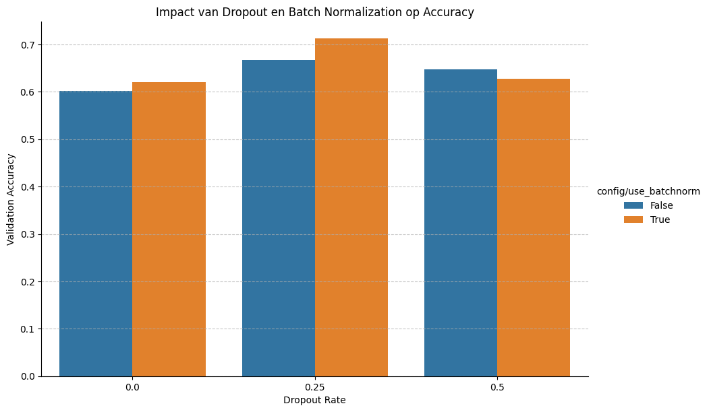

# Summary week 4
Hyperparameter Tuning Report: Ant & Bee Classification

Name: Wouter van Huis
Student number: 2142469
Institution: Hogeschool van Arnhem en Nijmegen (HAN)
Program: Master of Applied Data Science
Course: Deep Learning & Deployment (2025 P1A)
Date: 13-10-2025

Introduction
This report documents the process of systematically tuning a Convolutional Neural Network (CNN) to classify images from the Hymenoptera dataset (ants and bees). The objective was to validate a primary hypothesis and determine an optimal set of hyperparameters through an iterative, data-driven approach.

Hypothesis
"A Convolutional Neural Network, featuring multiple convolutional layers, batch normalization, and dropout, will achieve higher classification accuracy on the Hymenoptera dataset than a simple linear model. This is because a CNN is better suited to capture the spatial hierarchies and complex features (e.g., wings, antennae) present in image data."

Methodology
- Dataset: The Hymenoptera dataset consists of a training set of 244 images and a validation set of 153 images, split evenly between the 'ants' and 'bees' classes. All images were resized to 224x224 pixels and normalized.
- Model Architecture: A configurable CNN was designed in PyTorch. The base architecture included two convolutional blocks (Conv2d, ReLU, BatchNorm, MaxPool) followed by a classifier with two fully connected layers and a dropout layer.
- Tuning Framework: The Ray Tune library was employed to manage and execute the hyperparameter search experiments. An iterative, two-experiment approach was used to first identify a strong baseline and then refine it.

Experiments, Results, and Analysis
Experiment 1: Optimizing Learning Rate and Model Capacity.
The first experiment aimed to find the optimal learning rate and model capacity (number of filters), as these are known to be the most critical hyperparameters. A grid search was performed across 27 configurations.

Parameter Choices:
- Learning Rate (lr): A logarithmic scale ([0.0001, 0.001, 0.01]) was chosen. This is standard practice to efficiently test a wide range of magnitudes.
- Filters (filters1, filters2): Powers of two ([8, 16, 32, 64]) were selected to systematically scale the model's capacity.

Results & Analysis: The resulting heatmap clearly illustrates the parameter interactions.

The highest accuracy (~70%) was consistently achieved with a low learning rate of 0.0001. A high learning rate of 0.01 resulted in poor performance across the board, a classic sign of training instability where the optimizer overshoots the optimal solution. A filter combination of 16 for the first layer and 32 for the second provided the best balance of capacity and performance at this learning rate.

Experiment 2: Evaluating Regularization Techniques.
Using the best configuration from the first experiment as a baseline (lr=0.0001, filters1=16, filters2=32), a second, more focused experiment was conducted to measure the impact of Batch Normalization and Dropout.

Parameter Choices:
- Batch Normalization: A simple boolean choice (True/False) was used to validate its theoretical benefits empirically.
- Dropout Rate: Values of [0.0, 0.25, 0.5] were tested to compare no dropout (baseline), moderate dropout, and heavy dropout.

Results & Analysis: The grouped bar chart provides a clear comparison of the 6 trials.

Conclusions:
Batch Normalization provided a significant and consistent performance boost. Across all dropout rates, the models using Batch Norm achieved higher accuracy, validating its effectiveness in stabilizing training.
Also a moderate dropout rate of 0.25 yielded the highest accuracy (~71.2%). This suggests it provided a good balance, effectively preventing overfitting without hindering the model's ability to learn (underfitting), which was a slight issue at the higher 0.5 rate.

Reflection and Final Conclusion
The experimental process successfully validated the initial hypothesis. The final tuned CNN, achieving 71.2% validation accuracy, significantly outperforms a theoretical linear model by effectively learning the spatial features of the images.

The iterative approach proved highly efficient. By first isolating the critical learning rate, we established a stable foundation. Subsequently, fine-tuning with regularization techniques like Batch Normalization and Dropout provided incremental but significant gains. The results align perfectly with established deep learning theory: a stable learning rate is paramount, Batch Normalization aids convergence, and moderate Dropout improves generalization.

The final optimal configuration found through this process is:
- Learning Rate: 0.0001
- Filters: 16 (layer 1), 32 (layer 2)
- Batch Normalization: True
- Dropout Rate: 0.25
- FC Neurons: 128

Here are the [instructions](./instructions.md) and here is a script to start [hypertuning-assignment.ipynb](./myproject/hypertuning-assignment.ipynb)

[Go back to Homepage](../README.md)
